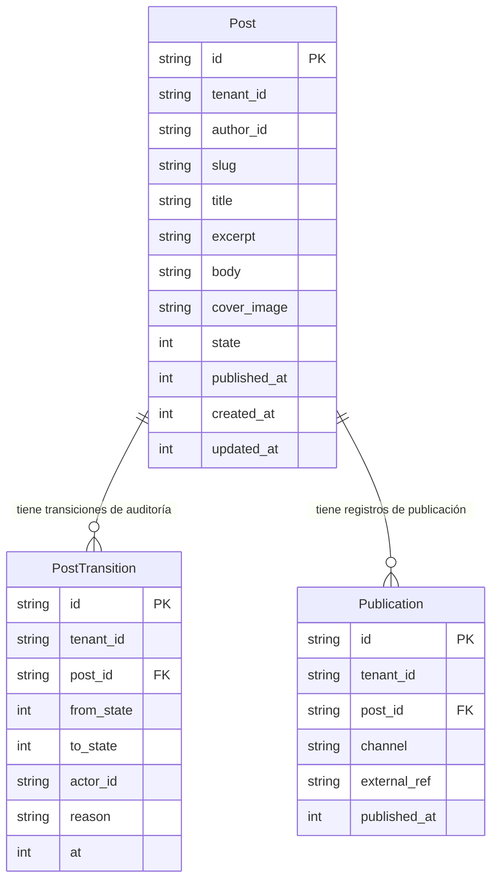

# ERD de Base de Datos

```mermaid
erDiagram
    Post ||--o{ PostTransition : "tiene transiciones de auditoría"
    Post ||--o{ Publication : "tiene registros de publicación"

    Post {
        string id PK
        string tenant_id
        string author_id
        string slug
        string title
        string excerpt
        string body
        string cover_image
        int state
        int published_at
        int created_at
        int updated_at
    }

    PostTransition {
        string id PK
        string tenant_id
        string post_id FK
        int from_state
        int to_state
        string actor_id
        string reason
        int at
    }

    Publication {
        string id PK
        string tenant_id
        string post_id FK
        string channel
        string external_ref
        int published_at
    }
```